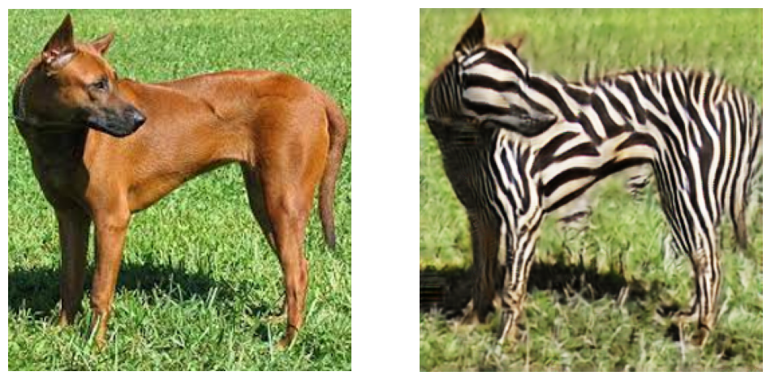

# Generative models for fun

Here resides my practice for generative models. These codes can be writen by myself or adapted from other sources with some modification. In case of adoption, I include credit in the corresponding notebooks.

| Model                                        | Pytorch | Tensorflow|
| -------------------------------------------- | ------------------------------------------------------------------------------------------------------------------------------------------------------------------------------------------------------------------------------------------- |-|
| [CycleGAN](https://arxiv.org/abs/1703.10593) | [cycleGAN_h2z](pytorch/cycleGAN_h2z.ipynb): transform horse to zebra and vice versa, experiment with different generators' architectures and coefficients for loss components (identity, GAN, and cycle)  ||
---